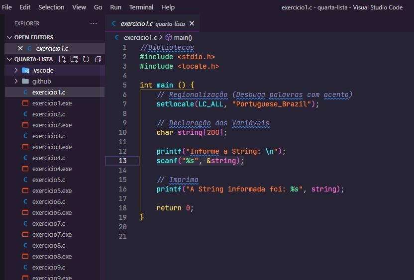

<h1 align="center">
    
</h1>

    <h3> 🔵 Quarta Lista 🔵 </h3>
    
     
    

## Lista 4

Lista de exercícios para praticar algoritmo estruturado e lógica de programação.

## Questões

1.	Faça um programa que leia uma string e a imprima. 
2.	Crie um programa que calcula o comprimento de uma string (não use a função strlen). 
3.	Entre com um nome e imprima o nome somente se a primeira letra do nome for ‘a’ (maiúscula ou minúscula). 
4.	Faça um programa que leia um nome e imprima as 4 primeiras letras do nome.
5.	Digite um nome, calcule e retorne quantas letras tem esse nome.
6.	Ler nome, sexo e idade. Se sexo for feminino e idade menor que 25, imprime o nome da pessoa e a palavra “ACEITA”, caso contrario imprimir “NAO ACEITA”. 
7.	Crie um programa que compara duas strings (não use a função strcmp). 
8.	Faça um programa que conte o numero de 1’s que aparecem em um string. Exemplo: “0011001” -> 3
9.	Escreva um programa que substitui as ocorrências de um caractere ‘0’ em uma   string por outro caractere ‘1’.
10.	Faça um programa que receba uma palavra e a imprima de tras-para-frente. 
11.	Faça um programa que receba do usuário uma string. O programa imprime a string sem suas vogais.
12.	Faça um programa que receba uma palavra e calcule quantas vogais (a, e, i, o, u) possui essa palavra. Entre com um caractere (vogal ou consoante) e substitua todas as vogais da palavra dada por esse caractere.
13.	Ler uma frase e contar quantos caracteres sao espac¸os em brancos. Lembre-se que uma frase e um conjunto de caracteres (vetor). 
14.	Faça um programa que leia uma palavra (maximo de 50 letras) e some 1 no valor ASCII de cada caractere da palavra. Imprima a string resultante.
15.	Escreva um programa para converter uma cadeia de caracteres de letras maiusculas em letras minusculas.  Dica: some 32 dos caracteres cujo codigo ASCII est  a entre 65 e 90. 
16.	Leia uma cadeia de caracteres e converta todos os caracteres para maiuscula.  Dica: subtraia 32 dos caracteres cujo codigo ASCII est  a entre 97 e 122. 
17.	Leia um vetor contendo letras de uma frase inclusive os espaços em branco. Retirar os espaços em branco do vetor e depois escrever o vetor resultante.
18.	Faça um programa em que troque todas as ocorrências de uma letra L1 pela letra L2 em uma string. A string e as letras L1 e L2 devem ser fornecidas pelo usuário. 
19.	Escreva um programa que leia a idade e o primeiro nome de 10 pessoas. Seu programa deve terminar quando uma idade negativa for digitada. Ao terminar, seu programa deve escrever o nome e a idade das pessoas mais jovens e mais velhas.
20.	Faça um programa que preencha uma matriz de string com os modelos de cinco carros (exemplos de modelos: Fusca, Gol, Vectra, etc.). Em seguida, preencha um vetor com o consumo desses carros, isto e, quantos quilômetros cada um deles faz com um litro de combustível. Calcule e mostre:
a)	O modelo de carro mais econômico;
b)	Quantos litros de combustível cada um dos carros cadastrados consome para percorrer uma distancia de 1.000 quilometros.
21.	Faça um programa que receba duas frases distintas e imprima de maneira invertida, trocando as letras A por *.
22.	Ler o nome e o valor de uma determinada mercadoria de uma loja. Sabendo que o desconto para pagamento a vista é de 10% sobre o valor total, calcular o valor a ser pago a vista. Escrever o nome da mercadoria, o valor total, o valor do desconto e o valor a ser pago a vista.
23.	Escreva um programa que recebe do usuário uma string S, um caractere C, e uma posição I e devolve o índice da primeira posição da string onde foi encontrado o caractere. OBS: A procura deve começar a partir da posição I. 
24.	Escreva um programa que leia duas palavras e diga qual deles vem primeiro na ordem alfabetica.  Dica: ‘a’ e menor do que ‘b’. 
25.	O código de César é uma das mais simples e conhecidas técnicas de criptografia.  E um tipo de substituição na qual cada letra do texto é substituída por outra, que se apresenta no alfabeto abaixo dela um numero fixo de vezes. Por exemplo, com uma troca de três posições, ‘A’ seria substituido por ‘D’, ‘B’ se tornaria ‘E’, e assim por diante. Implemente um programa que Faça uso desse Código de César (3 posições), entre com uma string e retorne a string codificada. Exemplo:
•	String: 
a ligeira raposa marrom saltou sobre o cachorro cansado
•	Nova string: 
D OLJHLUD UDSRVD PDUURP VDOWRX VREUH R FDFKRUUR FDQVDGR
26.	Faça um programa que, dada uma string, diga se ela e um palíndromo ou não. Lembrando que um palíndromo e uma palavra que tenha a propriedade de poder ser lida tanto da direita para a esquerda como da esquerda para a direita. Exemplo:
•	ovo
•	arara
•	Socorram me, subi no onibus em Marrocos.
•	Anotaram a data da maratona
27.	Construa um programa que leia duas strings fornecidas pelo usuário e verifique se a segunda string lida esta contida no final da primeira, retornando o resultado da verificação. 
28.	Leia duas cadeias de caracteres A e B. Determine quantas vezes a cadeia A ocorre na cadeia B.
29.	Leia uma cadeia de caracteres no formato “DD/MM/AAAA” e copie o dia, mes e ano para 3 variáveis inteiras. Antes disso, verifique se as barras estão no lugar certo, e se DD, MM e AAAA são numéricos. 
30.	Faça um programa para ler uma tabela contendo os nomes dos alunos de uma turma de 5 alunos. O programa deve solicitar ao usuário os nomes do aluno, sempre perguntando se ele deseja inserir mais um nome na lista. Uma vez lidos todos os alunos, o usuário ira indicar um nome que ele deseja verificar se está presente na lista, onde o programa deve procurar pelo nome (ou parte deste nome) e se encontrar deve exibir na tela o nome completo e o índice do vetor onde está guardado este nome.

## 🛠️ Linguagem

💻 C

### ☑️ Código:

## 🌟 CEFET / RJ

Essa lista foi passada no meu curso de Sistemas de Informação realizado no CEFET.

